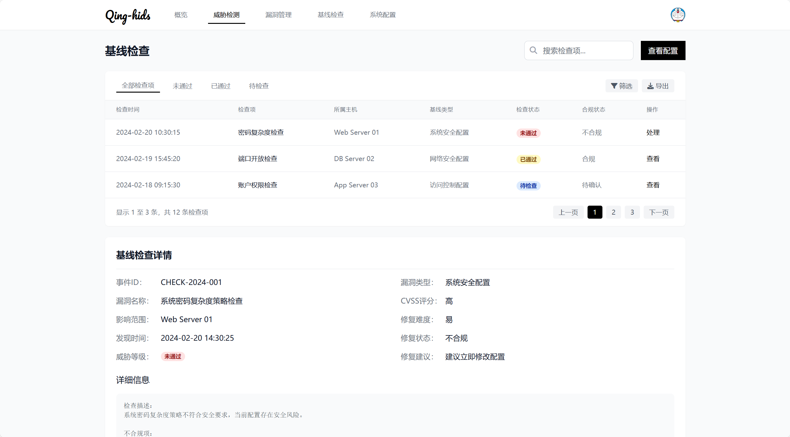

### Qing-HIDS

Qing-HIDS（Host-based Intrusion Detection System）是一个开源的主机入侵检测系统，为企业提供全面的安全防护。通过部署在各个主机上的代理，可以实时监控并分析主机活动，检测潜在的安全威胁，并提供直观的数据展示和操作界面。

### 功能介绍

1. **主机安全状态概览**

Qing-HIDS 提供了一个综合性的仪表盘界面，用于展示主机的整体安全状况。该界面包括但不限于以下内容：
- 主机整体安全评分：根据一系列安全指标计算得出的分数，用以评估主机的安全水平。
- 风险事件统计：列出已识别的风险事件的数量，帮助用户快速了解当前面临的安全挑战。
- 防护主机数量：显示接入了 Qing-HIDS 安全服务的主机总数。
- 在线/离线主机数量：区分并统计在线和离线主机的数量，确保对所有资产的可视性。

2. **实时告警监控区**

实时更新最新的安全告警信息，以便用户能够迅速响应安全事件。告警信息包含但不限于：
- 风险等级：标识每个告警的严重程度，便于优先处理高风险问题。
- 告警类型：说明触发告警的具体原因或类别。
- 主机信息：提供涉及告警的主机详情，如名称、IP地址等。
- 发生时间：记录告警发生的准确时间点。

   用户可以点击查看详情，进一步调查和处理告警。

3. **主机资产列表**

   列出所有连接到 Qing-HIDS 的主机，提供详细的资产信息，包括不限于： `主机名称`,`IP 地址`,`操作系统`,`在线状态`,`安全状态`

   支持通过关键字搜索和多条件筛选功能来快速定位特定主机。

4. **安全防护配置模块**

提供了一系列配置选项，允许管理员根据需求定制安全策略，包括但不限于：
- 入侵检测：设定规则以检测未授权访问尝试。
- 漏洞管理：定期扫描主机漏洞，并推荐修复措施。
- 病毒防护：启用或禁用病毒查杀功能，以及更新病毒库。
- 基线检查：依据安全基线进行合规性审查，确保主机配置符合标准。

5. **系统设置**

